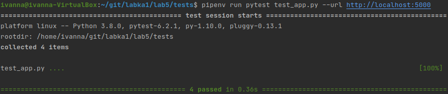
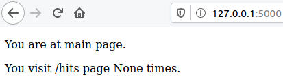
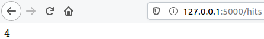
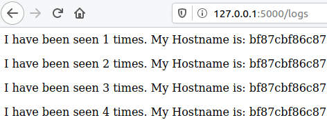

1. File `requirements.txt` contains dependencies for running the application.
2. Tests passed successfully:

   

3. Description of Makefile and its directives:
   - `STATES` and `REPO` - variables that contain tag names and the Docker Hub repository name;
   - `.PHONY` - a `make` utility that tells the file that the following targets are not files;
   - `$(STATES)` - target purpose build container;
   - `run` - target designation for creating network that will run the application; launch the application and repository `redis`;
   - `test-app` - target to run tests;
   - `docker-prune` - target to clean resources to be used in the operation of `Docker`.

4. All pages of site:

   
   
   
   
   

5. 